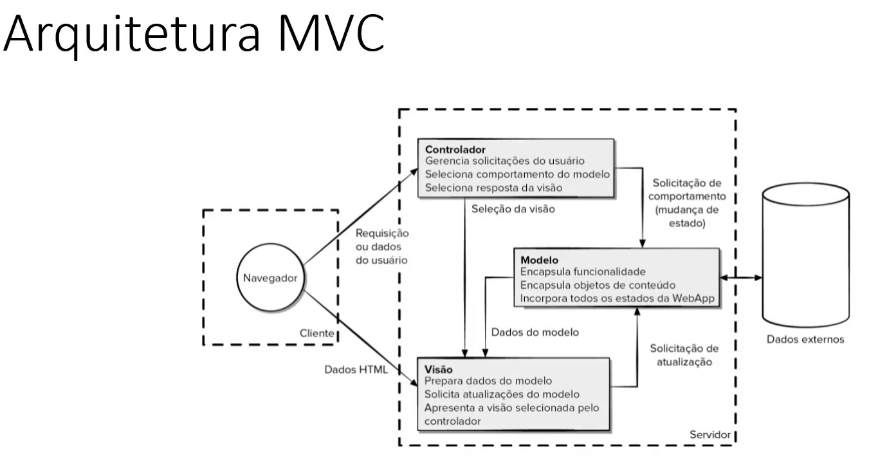
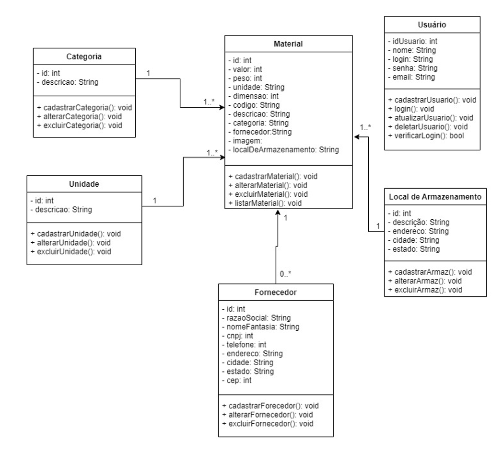
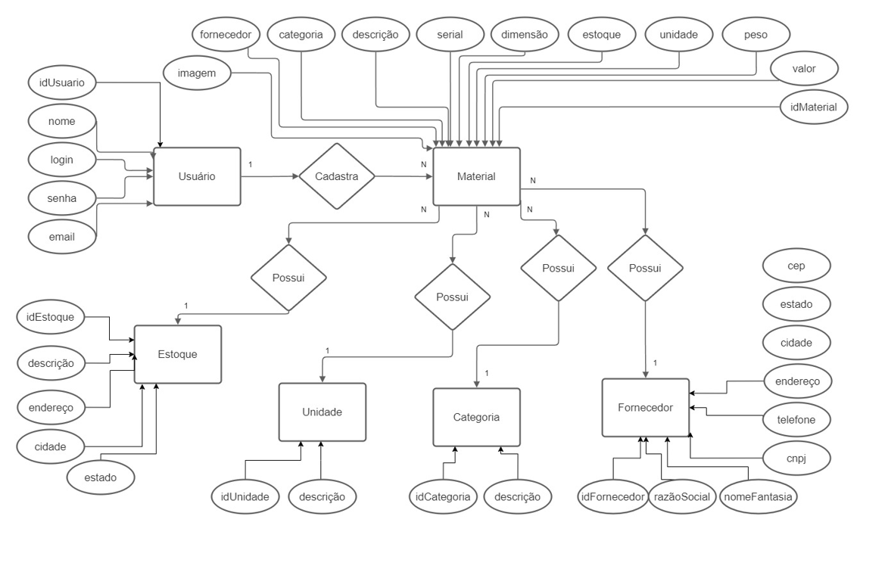
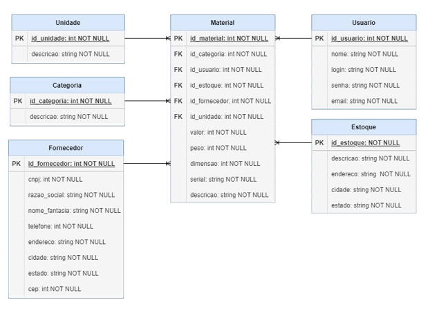

# Arquitetura da Solução

## Diagrama de Classes

## Modelo ER

## Projeto da Base de Dados

## Modelo Físico (DDL)

Entregar um arquivo banco.sql contendo os scripts de criação das tabelas do banco de dados. Este arquivo deverá ser incluído dentro da pasta src\bd.

- Arquivo inserido na pasta solicitada.

## Tecnologias Utilizadas

|Serviço |  Ferramenta Empregada |
|--|--|
| Framework ORM| Entity Framework |
| Banco de Dados Relacional| Microsoft SQL |
| Framework de Desenvolvimento| ASP Net CORE MVC |
| Linguagem de Programação| C# |
| Framework de folha de estilos| Bootstrap |
| Ambiente de Execução| .Net Framework |
| Serviço de Autenticação| Identity  |
| Controle e Armazenamento de Código| GitHub |
| Versionamento de Codigo Fonte| Git |
| Linguagem de Folha de Estilos| CSS |
| IDE de Desenvolvimento|Visual Studio 2022 |

## Hospedagem

A hospedagem será feita por meio da plataforma Heroku utilizando a integração Heroku + GitHub
